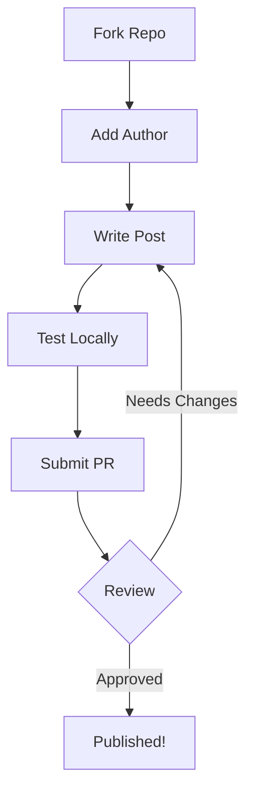

# How to Contribute to howdevs.work

Got a developer story burning to be told? A hard-won lesson that could help other devs? We'd love to hear it.

Contributing is straightforward – no complex workflows or bureaucracy. Just good old-fashioned open source collaboration.

## What we're looking for

We want real stories from real developers:

- **War stories** from the trenches (debugging nightmares, architecture decisions, scaling challenges)
- **Tool reviews** based on actual experience
- **Learning journeys** (how you picked up that new framework, what surprised you)
- **Team dynamics** and engineering culture insights
- **Career lessons** and pivotal moments

## The process

### 1. Fork and clone

Head to our [GitHub repo](https://github.com/MemerGamer/howdevs.work) and fork it. Then clone your fork locally:

```bash
git clone git@github.com:your-username/howdevs.work.git
cd howdevs.work
```

### 2. Add yourself as an author

Before writing your first post, add yourself to the authors list in `astro.config.mjs`:

```ts
starlightBlog({
  authors: {
    "your-github-username": {
      name: "Your Name",
      title: "What you do",
      picture: "https://avatars.githubusercontent.com/u/your-user-id?v=4",
      url: "https://your-website.com", // optional
    },
  },
})
```

### 3. Write your post

Create a new Markdown file in the appropriate language folder:

- English: `src/content/docs/en/blog/your-post-slug.md`
- Hungarian: `src/content/docs/hu/blog/your-post-slug.md` (optional)
- NOTE: You can add more languages by adding a new folder to the `src/content/docs/` folder and adding the language code to the folder name.

Every post needs frontmatter at the top:

```yaml
---
title: Your Compelling Title
description: A one-line summary of what readers will learn
date: 2025-11-11
authors:
  - your-github-username
tags:
  - relevant
  - tags
---
```

Then write your story in Markdown. Use code blocks, images, whatever helps tell your story effectively.

### 4. Test it locally

Run the dev server to see how your post looks:

```bash
npm install
npm run dev
```

Your post should appear in the sidebar and be accessible via the blog listing.

### 5. Submit your PR

Once you're happy with your post, commit your changes and push to your fork:

```bash
git add .
git commit -m "Add post: Your Post Title"
git push origin main
```

Then open a pull request from your fork to our main repo.

## Writing tips

### Be conversational

Write like you're explaining something to a colleague over coffee. Skip the corporate speak and just talk like a human.

### Show, don't just tell

Instead of "microservices are complex," tell us about the time you spent three days tracking down a bug that turned out to be a race condition between two services.

### Include code, but sparingly

Code examples are great when they illustrate a point. But don't dump your entire codebase – just the relevant bits.

### Use diagrams when helpful

You can use Mermaid diagrams to illustrate workflows, architecture, or processes. Here's an example:



### Use your real experience

The best posts come from actual problems you've solved, not theoretical scenarios. What did you learn the hard way? What surprised you?

## What happens next?

We'll review your PR for:

- Basic spelling and grammar
- Relevance to the developer audience
- Technical accuracy
- Formatting consistency

Once approved, your post goes live! We'll handle the deployment and let you know when it's published.

## Questions?

Stuck on something? Open an issue on the repo or ping us. We're here to help, not gatekeep.

Looking forward to your story! 🚀
