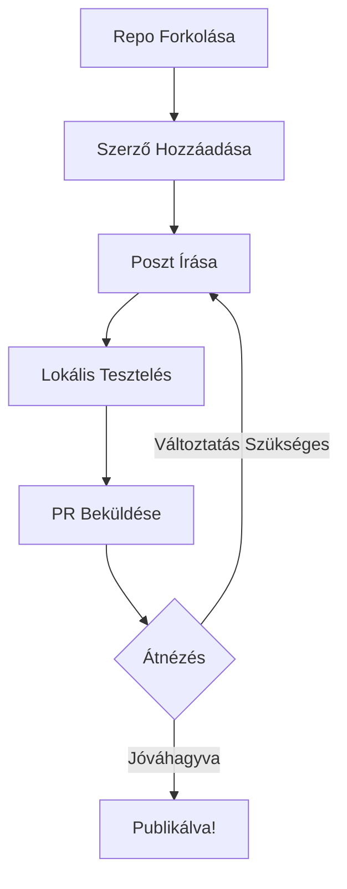

# Hogyan járulj hozzá a howdevs.work-hez

Van egy érdekes fejlesztői sztorid, amit meg szeretnél osztani? Egy keményen megszerzett tapasztalat, ami segíthet más fejlesztőknek? Szívesen hallanánk!

A hozzájárulás egyszerű, nincsenek bonyolult folyamatok vagy bürokrácia. Csak jó öreg nyílt forráskódú együttműködés.

## Mit keresünk

Igazi történeteket akarunk igazi fejlesztőktől:

- **Háborús históriákat** a lövészárokból (debug pokol, architektúrális döntések, skálázási kihívások)
- **Eszköz értékeléseket** tényleges tapasztalatok alapján
- **Tanulási utazásokat** (hogyan sajátítottad el azt az új frameworköt, mi lepett meg)
- **Csapatdinamikát** és mérnöki kultúra betekintéseket
- **Karrier leckéket** és fordulópontokat

## A folyamat

### 1. Forkold és klónozd

Menj a [GitHub repónkhoz](https://github.com/MemerGamer/howdevs.work) és forkold. Aztán klónozd le lokálisan:

```bash
git clone git@github.com:felhasznaloneved/howdevs.work.git
cd howdevs.work
```

### 2. Add hozzá magad szerzőként

Az első posztod előtt add hozzá magad a szerzők listájához az `astro.config.mjs`-ben:

```ts
starlightBlog({
  authors: {
    "github-felhasznaloneved": {
      name: "A neved",
      title: "Mit csinálsz",
      picture: "https://avatars.githubusercontent.com/u/user-id?v=4",
      url: "https://weboldald.com", // opcionális
    },
  },
})
```

### 3. Írd meg a posztodat

Hozz létre egy új Markdown fájlt a megfelelő nyelvi mappában:

- Angol: `src/content/docs/en/blog/poszt-slug.md`
- Magyar: `src/content/docs/hu/blog/poszt-slug.md` (opcionális)
- NOTE: Ha új nyelvet szeretnél hozzáadni, hozz létre egy új mappát a `src/content/docs/` mappában és adja hozzá a nyelvi kódot a mappánévhez.

Minden posztnak kell frontmatter a tetején:

```yaml
---
title: A meggyőző címed
description: Egy soros összefoglaló arról, mit tanulnak az olvasók
date: 2025-11-11
authors:
  - github-felhasznaloneved
tags:
  - relevans
  - cimkek
---
```

Aztán írd meg a történeted Markdownban. Használj kódblokkokat, képeket, bármit, ami segít hatékonyan elmesélni a történetedet.

### 4. Teszteld lokálisan

Indítsd el a dev szervert, hogy lásd, hogyan néz ki a posztod:

```bash
npm install
npm run dev
```

A posztodnak meg kell jelennie az oldalsávban és elérhetőnek kell lennie a blog listázáson keresztül.

### 5. Küldd be a PR-t

Ha elégedett vagy a poszttal, commitold a változtatásokat és pusholds a forkodba:

```bash
git add .
git commit -m "Poszt hozzáadása: Poszt címe"
git push origin main
```

Aztán nyiss egy pull requestet a forkodból a fő repónkba.

## Írási tippek

### Beszélj természetesen

Írj úgy, mintha egy kollégádnak magyaráznál el valamit egy kávé mellett. Hagyd el a céges beszédet és beszélj úgy, mint egy ember.

### Mutasd meg, ne csak mondd el

Ahelyett hogy azt írnád, hogy "a mikroszerviszek bonyolultak", mesélj arról, amikor három napot töltöttél egy bug kinyomozásával, ami végül két szolgáltatás közötti race condition volt.

### Használj kódblokkokat, de értelmesen

A kód példák nagyszerűek, amikor illusztrálnak egy gondolatot. De ne töltsd ide az egész kódbázisodat, csak a releváns részeket.

### Használj diagramokat, amikor segít a magyarázatban

Használhatsz Mermaid diagramokat a munkafolyamatok, architektúra vagy más folyamatok illusztrálásához. Íme egy példa:



### Mesélj valódi tapasztalatokról

A legjobb posztok valódi problémákból származnak, amiket megoldottál, nem elméleti forgatókönyvekből. Mit tanultál? Mi lepett meg?

## Mi történik ezután?

Átnézzük a PR-t, a következőket vizsgáljuk:

- Alapvető helyesírás és nyelvtan
- Relevancia a fejlesztői közönséghez
- Technikai pontosság
- Formázási konzisztencia

Jóváhagyás után a posztod élőbe megy! Mi intézzük a telepítést és szólunk, amikor publikálva lett.

## Kérdések?

Elakadtál valamin? Nyiss egy issue-t a repóban vagy írj nekünk. Itt vagyunk, hogy segítsünk, nem hogy kapuőrösködjünk.

Várom a történetedet! 🚀
